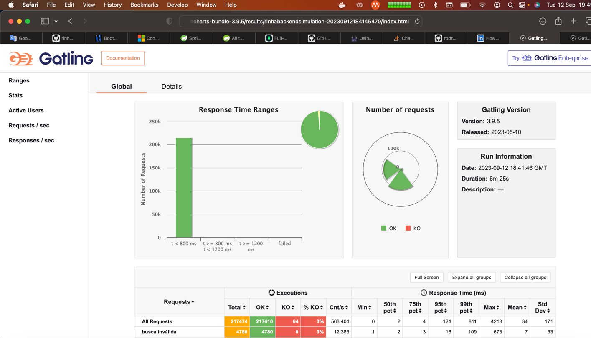
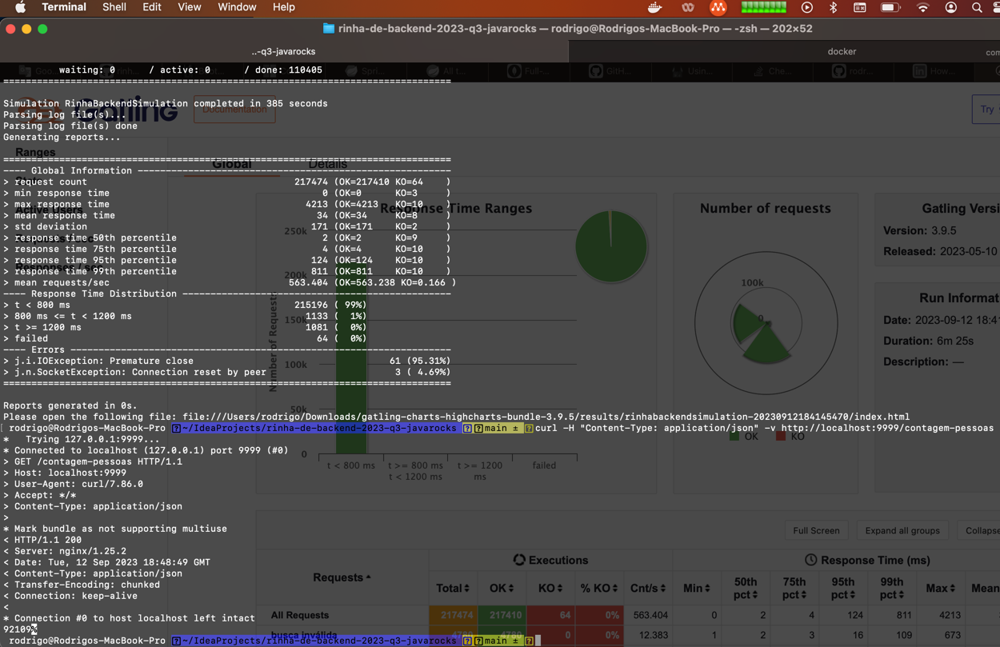

# Rinha Backend - Java Rocks!

## Stack
 * Spring Boot 3
 * GraalVM - Java 20 - Virtual Threads
 * MongoDB

### Build

`./gradlew build`

### Docker Compose

MacM1 use `fielcapao/rinha-de-backend-2023-q3-javarocks-native:macm1-arm64`

Linux use `fielcapao/rinha-de-backend-2023-q3-javarocks-native:linux-amd64`

`docker-compose up -d`

### Gatling

Follow https://github.com/zanfranceschi/rinha-de-backend-2023-q3/tree/main/teste/gatling

### Build docker container using Spring

`./gradlew bootBuildImage` takes a lot of time and need minimum 16GB memory.

### Build docker container using nativeCompile

`./gradlew nativeCompile`


### Build using Dockerfile

```
docker login container-registry.oracle.com
#Need to enter your oracle credentials

docker build -t rinha-de-backend-2023-q3-javarocks-native .
```






## References
[Spring Boot Gradle Plugin](https://docs.spring.io/spring-boot/docs/current/gradle-plugin/reference/htmlsingle/#build-image.examples)

[Spring Data MongoDB](https://docs.spring.io/spring-data/mongodb/docs/current/reference/html/#mapping-usage-indexes.text-index)

[GraalVM](https://www.graalvm.org/latest/docs/getting-started/macos/)

[Spring Boot 3 TestContainers](https://spring.io/blog/2023/06/23/improved-testcontainers-support-in-spring-boot-3-1)

[Full Text Search MongoDB](https://stackoverflow.com/questions/54066573/how-to-create-full-text-search-query-in-mongodb-with-spring-data)